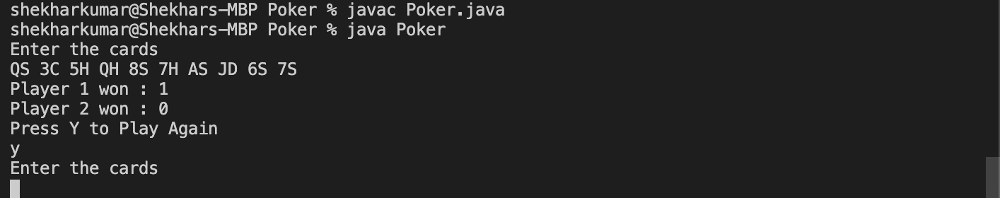
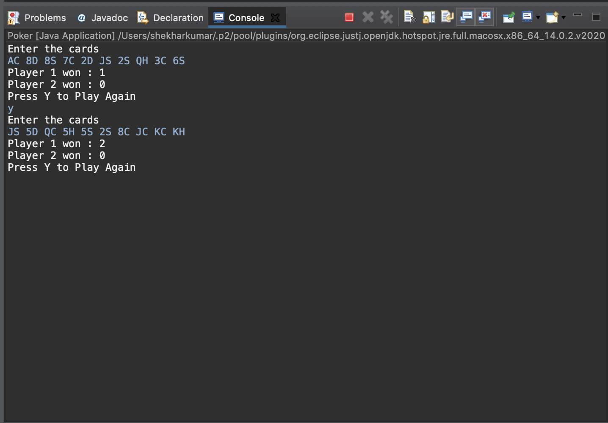

# Simple_PokerGame
A Java application for simple poker game
 To start the program remember to install java and jdk.
 1) Run javac Poker.java
 2) Run java Poker
 
 3) Enter the deck consisting of 10 cards in two digit format(example: JS 6H TS KC QC QS TH 8C AD AH)
 Remeber A here is used as Top card i.e the value of Ace is 14 and not one
 4)Press Y to play again
 
 The Code displays the number of hands won by Player1 and Player 2
 
 
